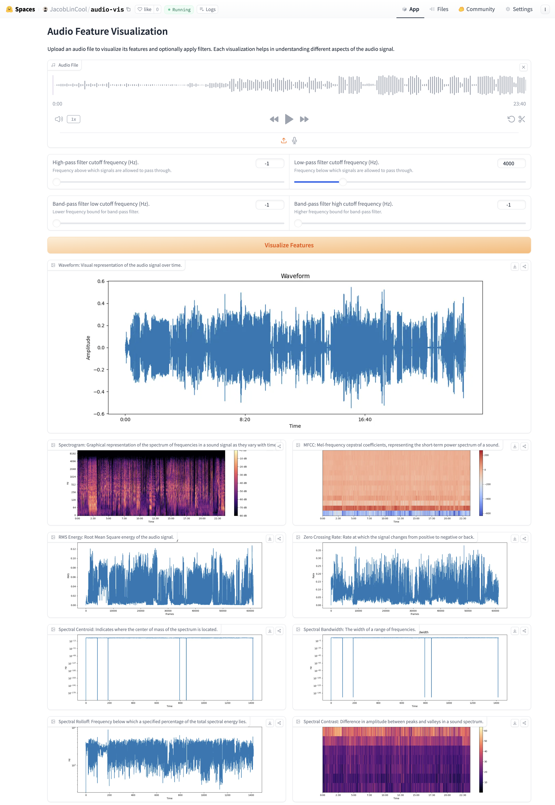

# audio-vis

Visualizing Audio Features.

<a href="https://huggingface.co/spaces/jacoblincool/audio-vis" target="_blank">
    <picture>
        <source media="(prefers-color-scheme: dark)" srcset="https://huggingface.co/datasets/huggingface/badges/resolve/main/open-in-hf-spaces-md-dark.svg">
        
    </picture>
</a>

## Setup

```sh
micromamba create -n audio-vis python==3.12 librosa matplotlib numpy scipy pillow gradio -c conda-forge
```

## Run

```sh
micromamba activate audio-vis
python app.py
```

## Screenshot


